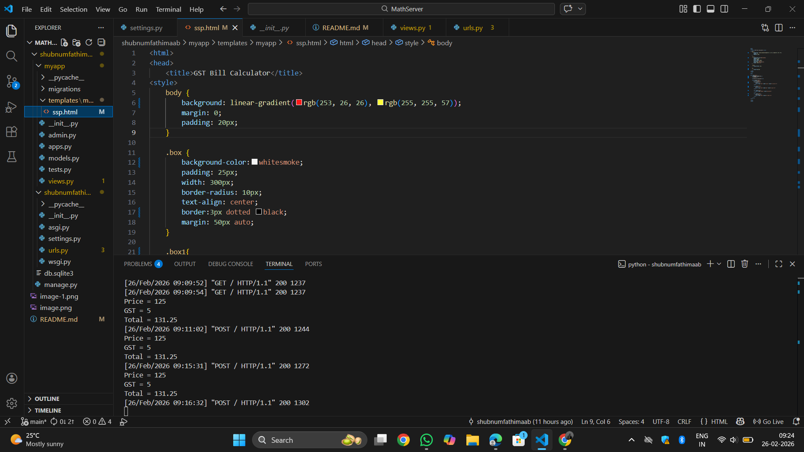
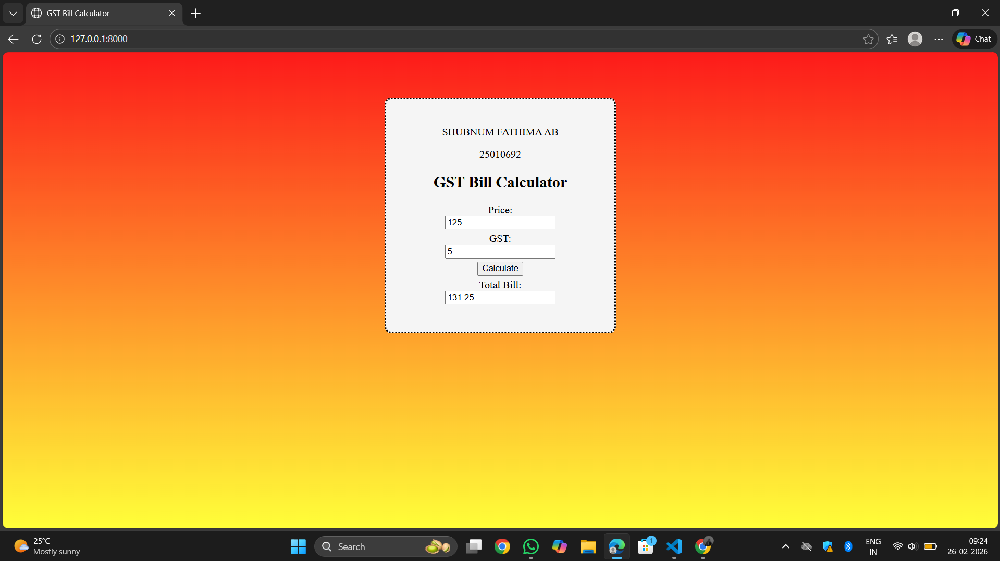

# Ex.04 Design a Website for Server Side Processing
## Date: 
25/02/2026

## AIM:
To create a web page to calculate total bill amount with GST from price and GST percentage using server-side scripts.

## FORMULA:
Bill = P + (P * GST / 100)
<br> P --> Price (in Rupees)
<br> GST --> GST (in Percentage)
<br> Bill --> Total Bill Amount (in Rupees)

## DESIGN STEPS:

### Step 1:
Clone the repository from GitHub.

### Step 2:
Create Django Admin project.

### Step 3:
Create a New App under the Django Admin project.

### Step 4:
Create a HTML file to implement form based input and output.

### Step 5:
Create python programs for views and urls to perform server side processing.

### Step 6:
Receive input values from the form using request.POST.get().

### Step 7:
Calculate the total bill amount (including GST).

### Step 8:
Display the calculated result in the server console.

### Step 9:
Render the result to the HTML template.

### Step 10:
Publish the website in Localhost.

## PROGRAM:
```
<html>
<head>
    <title>GST Bill Calculator</title>
<style>
    body {
        background: linear-gradient(rgb(253, 26, 26), rgb(255, 255, 57));
        margin: 0;
        padding: 20px;
    }

    .box {
        background-color:whitesmoke;
        padding: 25px;
        width: 300px;
        border-radius: 10px;
        text-align: center;
        border:3px dotted black;
        margin: 50px auto;
    }

    .box1{
        margin-bottom: 5px;
    }

    h3{
        margin-top:10px
    }
</style>
</head>

<body>

<div class="box">
    <p>SHUBNUM FATHIMA AB</p>
    <P>25010692</P>
    
    <h2>GST Bill Calculator</h2>

    <form method="POST">
        
        <div class="box1">
            Price:<br>
            <input type="text" name="price" value="{{ price }}">
        </div>

        <div class="box1">
            GST:<br>
            <input type="text" name="gst" value="{{ gst }}">
        </div>

        <div class="box1">
            <input type="submit" value="Calculate">
        </div>

        <div class="box1">
            Total Bill:<br>
            <input type="text" value="{{ total }}">
        </div>

    </form>
</div>

</body>
</html>


views.py

from django.shortcuts import render

def calculate_total(request):
    P = 0
    G = 0
    T = 0

    if request.method == "POST":
        P = int(request.POST.get('price', 0))
        G = int(request.POST.get('gst', 0))
        T = P + (P * G / 100)

        print("Price =", P)
        print("GST =", G)
        print("Total =", T)

    return render(request, 'myapp/ssp.html', {'price': P,'gst': G,'total': T})


    urls.py

    from django.contrib import admin
from django.urls import path
from myapp import views

urlpatterns = [
    path('', views.calculate_total, name='Total')
]
```

## OUTPUT - SERVER SIDE:


## OUTPUT - WEBPAGE:


## RESULT:
The a web page to calculate total bill amount with GST from price and GST percentage using server-side scripts is created successfully.
